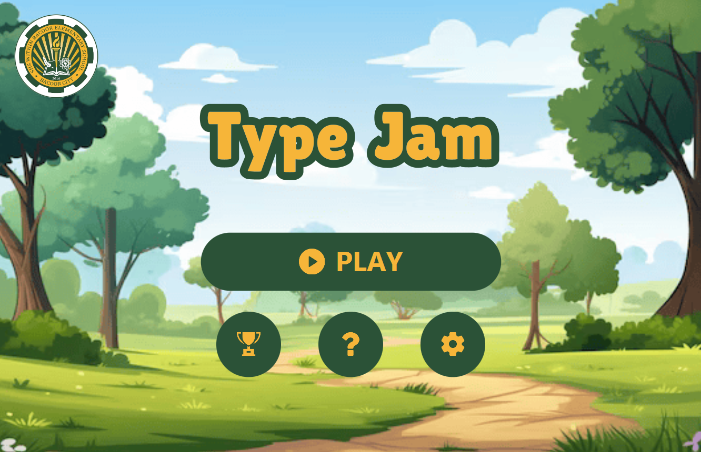

# Type Jam: Master the Keys ⌨️

<div align="center">
  
  
  **A fun and engaging typing practice game built with JavaFX**
  
  [](https://www.oracle.com/java/)
  [](https://openjfx.io/)
  [](https://maven.apache.org/)
</div>

---

## 📖 Description

**Type Jam** is an interactive typing practice application designed to help users improve their typing speed and accuracy through gamified challenges. Whether you're a student looking to master keyboard skills, a teacher seeking an engaging educational tool, or simply someone wanting to type faster, Type Jam offers an enjoyable way to develop your typing proficiency.

### Why Type Jam?

- **Educational Purpose**: Built as a learning tool to make typing practice fun and engaging
- **Skill Development**: Improve both typing speed (WPM) and accuracy through structured practice
- **Progress Tracking**: Monitor your improvement with detailed statistics and leaderboards
- **Gamified Experience**: Earn stars, compete on leaderboards, and receive motivational feedback

### Who It's For

- 🎓 **Students**: Develop essential typing skills for academic success
- 👨‍🏫 **Teachers**: Classroom-ready tool for teaching typing fundamentals
- 🏫 **Schools**: Engaging educational resource for computer labs
- 💼 **Professionals**: Anyone looking to boost typing efficiency
- 🎮 **Casual Users**: Fun way to practice and improve typing skills

---

## ✨ Features

### ⭐ Star-Based Rating System
Earn 1-5 stars based on your performance! Your rating depends on:
- **Words Per Minute (WPM)**: How fast you type
- **Accuracy**: How precise your keystrokes are
- **Characters Typed**: The volume of text completed

Receive congratulatory messages tailored to your star rating to keep you motivated!

### 🎯 Difficulty Levels
Choose your challenge level:
- **Easy**: Perfect for beginners learning keyboard layouts
- **Medium**: Intermediate texts for building speed
- **Hard**: Advanced passages for expert typists

### 🎮 Game Modes
- **Challenge Mode**: Race against the clock with timed challenges. Complete as many passages as possible before time runs out!
- **Practice Mode**: Take your time and practice at your own pace. End the session whenever you're ready.

### 📊 Fair & Competitive Leaderboard
- Track top performances filtered by difficulty level
- Rankings based on stars earned, WPM, and accuracy
- Fair scoring system that rewards both speed and precision
- Visual rank indicators (1st, 2nd, 3rd place badges)

### 🔊 Immersive Sound Design
- **Sound Effects**: Keyboard typing sounds, button clicks, and error notifications
- **Background Music**: Motivational melodies to enhance your practice
- **Countdown Timer**: Audio cues when time is running out
- **Congratulatory Sounds**: Celebration audio for achievements
- **Volume Controls**: Adjustable settings for music and sound effects

### 🎨 Additional Features
- Clean, user-friendly interface
- Real-time typing feedback with color-coded text
- Confetti animation for celebrations
- Detailed results screen with comprehensive statistics
- Persistent settings and leaderboard data
- Custom fonts and professional styling

---

## 🎮 Usage

### Starting the Game

1. **Launch Type Jam** from the executable or via IDE
2. From the main menu, select:
   - **Play** to start a typing session
   - **Leaderboard** to view top scores
   - **Settings** to adjust sound preferences
   - **About Us** to learn more about the developers

### Selecting Difficulty

1. Click **Play** from the main menu
2. Choose your preferred **Difficulty Level**:
   - Easy
   - Medium
   - Hard
3. Select your **Game Mode**:
   - **Challenge Mode** (timed) - Choose time limit: 1 min, 3 min, or 5 min
   - **Practice Mode** (untimed) - Practice at your own pace
4. Enter your name and click **Let's Type!**

### How Scoring Works

#### Star Rating (1-5 Stars)
Stars are calculated using a two-tier system:

**Tier 1: Character Volume**
- Less than 30 characters: 0 stars
- 30-49 characters: Max 1 star
- 50-99 characters: Max 2 stars
- 100-149 characters: Max 3 stars
- 150-199 characters: Max 4 stars
- 200+ characters: Max 5 stars

**Tier 2: Performance Thresholds**
- **5 Stars**: 55+ WPM and 95%+ accuracy
- **4 Stars**: 45+ WPM and 90%+ accuracy
- **3 Stars**: 35+ WPM and 85%+ accuracy
- **2 Stars**: 25+ WPM and 75%+ accuracy
- **1 Star**: Below above thresholds

Your final star rating is the **minimum** of both tiers.

#### Leaderboard Ranking
Entries are sorted by:
1. **Stars** (highest first)
2. **WPM** (highest first)
3. **Accuracy** (highest first)
4. **Timestamp** (earliest first for ties)

Only **Challenge Mode** scores appear on the leaderboard to ensure fair competition!

---

## 🛠️ For Developers

### Prerequisites
- Java Development Kit (JDK) 17 or higher
- Maven 3.x
- IDE with JavaFX support (IntelliJ IDEA recommended)

### Quick Start

```bash
# Build the project
mvnw clean package

# Run locally
mvnw javafx:run
```

### Project Structure
```
Type-Jam/
├── src/main/java/com/example/typejam/    # Java source files
├── src/main/resources/                    # Assets, FXML, CSS, data
│   ├── assets/                            # Images and sounds
│   ├── data/                              # JSON data files
│   ├── fonts/                             # Custom fonts
│   └── styles/                            # CSS stylesheets
├── pom.xml                                # Maven configuration
└── README.md                              # This file
```

For more detailed developer instructions, see [INSTALLATION.md](INSTALLATION.md).

---

## 📋 System Requirements

- **OS**: Windows 10 or higher (macOS/Linux via source)
- **RAM**: 4 GB minimum
- **Storage**: 200 MB disk space

---

## ⬇️ Download

Download the Windows executable (zipped) for Type Jam from Google Drive:

🔗 [Type Jam - Windows EXE (Zipped)](https://drive.google.com/drive/folders/1e14NgyUluS3bvRHoUus2xPAgtqBwnDCo?usp=sharing)

---


## 📄 License

This project is created for educational purposes.

---

## 🙏 Acknowledgments

- Custom typing texts curated for educational value
- Sound effects and music for enhanced user experience
- JavaFX community for excellent documentation and resources

---

<div align="center">
  <strong>Happy Typing! 🎉</strong>
  <br>
  Made with ☕ and JavaFX
</div>

